# Voice Agent System Architecture

## Overview

A sophisticated multi-agent legal assistant system built with Flutter frontend and Python LiveKit Agents backend. The system provides both continuous conversation and click-to-talk modes with multi-language support (English/Arabic).

## High-Level Architecture


## Component Architecture

### Frontend Components (Flutter)


### Backend Architecture


## Data Flow Diagrams

### Authentication & Connection Flow


### Agent Switching Flow


### Click-to-Talk Pipeline


### File Upload Pipeline


### Text Chat Flow

```mermaid
graph TD
    USER[User Types Message] --> CP[ChatProvider]
    CP --> DECISION{LiveKit Connected?}
    
    DECISION -->|Yes| LK_PATH[LiveKit Path]
    DECISION -->|No| GEMINI_PATH[Gemini Fallback]
    
    subgraph "LiveKit Path"
        LK_PATH --> LKS[LiveKitService]
        LKS --> |publishData| WORKER[Agent Worker]
        WORKER --> AGENT[Current Agent]
        AGENT --> STT_LLM[Skip STT → LLM → TTS]
        STT_LLM --> |Response| DATA_CHANNEL[Data Channel]
        DATA_CHANNEL --> CP_RESPONSE[ChatProvider.handleAgentResponse]
    end
    
    subgraph "Gemini Fallback"
        GEMINI_PATH --> CS[ChatService]
        CS --> GS[GeminiService]
        GS --> |HTTP API| GEMINI_API[Gemini API]
        GEMINI_API --> |Response| CS_RESPONSE[ChatService Response]
        CS_RESPONSE --> CP_RESPONSE
    end
    
    CP_RESPONSE --> UI[Update Chat UI]
```



## Agent Configuration Matrix

| Agent Type | Language | Mode | STT | LLM | TTS | Turn Detection |
|------------|----------|------|-----|-----|-----|----------------|
| AttorneyAgent | English | Continuous | Deepgram Nova-2 | Groq Llama3-8b | Azure Davis | VAD |
| ClickToTalkAgent | English | Manual | Deepgram Nova-2 | Groq Llama3-8b | Azure Onyx | Manual |
| ArabicAgent | Arabic | Continuous | Azure ar-SA/ar-EG | Groq allam-2-7b | Azure ar-OM-Abdullah | VAD |
| ArabicCTTAgent | Arabic | Manual | Azure ar-SA/ar-EG | Groq allam-2-7b | Azure ar-OM-Abdullah | Manual |

## Data Channel Communication

### Outbound Messages (App → Agent)

| Message | Purpose | Target Agents |
|---------|---------|---------------|
| `start_turn` | Begin click-to-talk recording | CTT, Arabic CTT |
| `end_turn` | Process recorded audio | CTT, Arabic CTT |
| `cancel_turn` | Cancel recording | CTT, Arabic CTT |
| `interrupt_agent` | Stop current agent speech | All |
| `switch_to_attorney` | Switch to continuous English | All |
| `switch_to_click_to_talk` | Switch to manual English | All |
| `switch_to_arabic` | Switch to continuous Arabic | All |
| `switch_to_arabic_click_to_talk` | Switch to manual Arabic | All |
| `chat:<text>` | Text message | All |
| `ping` | Keep-alive | All |

### Inbound Messages (Agent → App)

| Message Format | Purpose | UI Display |
|----------------|---------|------------|
| `active_agent:<type>` | Agent switch confirmation | 🤖 Active agent: {type} |
| `status_<info>` | System status | 🔔 Status: {info} |
| `session_<info>` | Session info | 🆔 {info} |
| Plain text | Agent response | Direct display |
| JSON with text field | Structured response | Extract and display text |

## File Processing Support

### Supported File Types


### File Size & Validation

- **Max Size**: 50MB (configurable in `FileTypeConstants.maxFileSize`)
- **Chunk Size**: 16KB for streaming uploads
- **Extensions**: pdf, doc, docx, txt, jpg, png, jpeg
- **Validation**: Size, extension, MIME type verification

## Deployment Architecture

### Process Types (Procfile)

```yaml
web: cd backend && uvicorn token_service.main:app --host 0.0.0.0 --port $PORT
worker: cd backend && python3 -m agent.agent start
```

### Environment Configuration

#### Frontend (.env)
```bash
TOKEN_ENDPOINT=http://localhost:8080/getToken  # Primary
LIVEKIT_SANDBOX_ID=your_sandbox_id            # Fallback
```

#### Backend (.env)
```bash
# Required: LiveKit Configuration
LIVEKIT_URL=wss://your-project.livekit.cloud
LIVEKIT_API_KEY=your_api_key_here
LIVEKIT_API_SECRET=your_api_secret_here
LIVEKIT_AGENT_NAME=agent-HAAKEEM

# AI Services
DEEPGRAM_API_KEY=your_deepgram_key
GROQ_API_KEY=your_groq_key
AZURE_SPEECH_KEY=your_azure_key
AZURE_SPEECH_REGION=your_azure_region
```

### Memory Optimization

```python
WorkerOptions(
    entrypoint_fnc=entrypoint,
    prewarm_fnc=prewarm,
    agent_name=agent_name,
    job_executor_type=JobExecutorType.THREAD,  # Thread-based
    num_idle_processes=0,                      # No idle processes
    concurrency=1,                             # Single worker
    concurrency_mode="threads"                 # Thread mode
)
```

## Performance Characteristics

### Latency Targets

| Operation | Target Latency | Notes |
|-----------|----------------|-------|
| Agent Switch | < 2 seconds | Includes session cleanup |
| CTT Start | < 200ms | Microphone enable + start_turn |
| CTT Process | < 5 seconds | Full STT → LLM → TTS pipeline |
| File Upload | < 10 seconds | Depends on file size |
| Text Response | < 3 seconds | LLM processing time |

### Resource Usage

- **Frontend**: Client-side STT for local feedback, minimal processing
- **Backend**: 
  - Token Service: Stateless, minimal memory
  - Agent Worker: Single-threaded, ~200-500MB RAM per session
  - Model Loading: Silero VAD preloaded, other models on-demand

## Security Considerations

### Authentication
- JWT tokens signed server-side with LiveKit credentials
- Client never sees API secrets
- Tokens include room-specific permissions

### Data Privacy
- Audio streams directly to LiveKit infrastructure
- No persistent storage of voice data
- File uploads processed in memory only
- Chat history stored locally in app only

### CORS Configuration
```python
app.add_middleware(
    CORSMiddleware,
    allow_origins=["*"],  # Restrict in production
    allow_credentials=True,
    allow_methods=["*"],
    allow_headers=["*"],
)
```

## Monitoring & Observability

### Health Checks
- Token Service: `GET /health` - API key validation, service status
- Agent Worker: Logging with structured events
- LiveKit Cloud: Built-in monitoring and metrics

### Key Metrics
- Connection success rate
- Agent switch completion time
- File processing success rate
- Audio quality metrics (from LiveKit)
- Response generation latency

### Logging Strategy
- **Frontend**: Debug prints for state changes and API calls
- **Backend**: Structured logging with correlation IDs
- **LiveKit**: Built-in WebRTC metrics and connection stats


*This architecture documentation covers the complete system design, data flows, and operational characteristics of the Voice Agent system as of the current implementation.*
